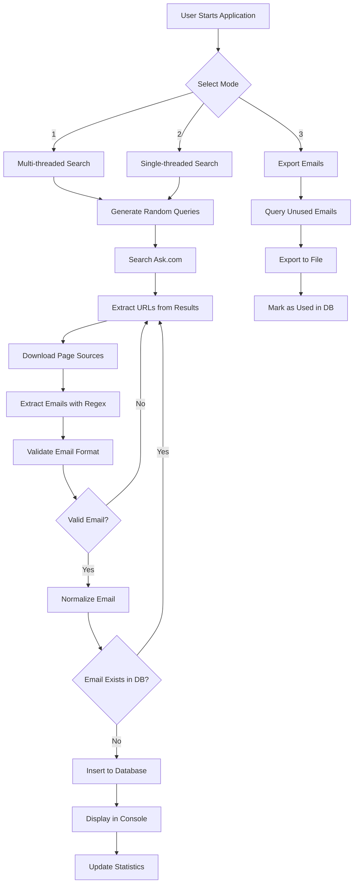
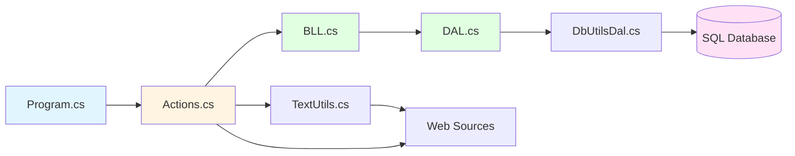
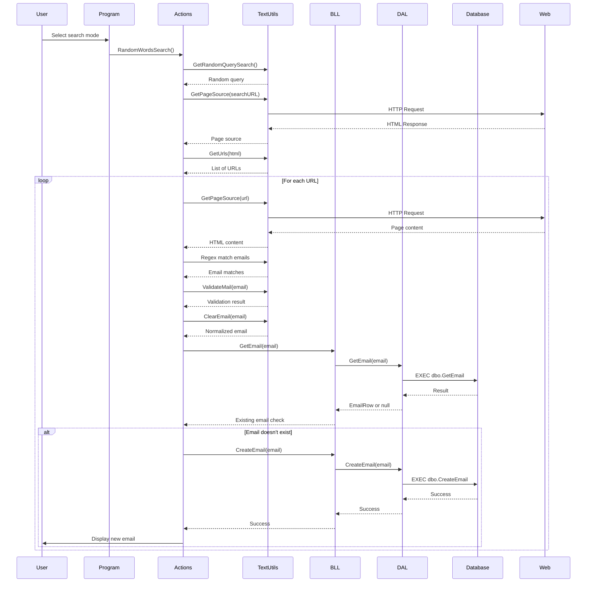

# CV Spider V5 Console Final

A .NET console application that searches multiple search engines for email addresses, validates them, and stores them in a SQL Server database. Built in January 2016, this is the fifth and final version of the CV Spider project.

## Overview

CV Spider automates the process of discovering and collecting email addresses from public web sources using search engine queries. The application performs intelligent email validation, normalization, and deduplication before storing results in a SQL database.

## Features

- 🔍 **Multi-Search Engine Support**: Originally designed to work with Google, Ask.com, AOL, Walla, Bing, and Yahoo (currently configured for Ask.com)
- 🧵 **Multi-threaded Processing**: Parallel execution with configurable thread count for faster collection
- ✅ **Advanced Email Validation**: Comprehensive regex-based validation with format checking and domain correction
- 🔄 **Smart Deduplication**: Automatic checking against existing database entries
- 🧹 **Email Normalization**: Intelligent cleaning and correction of malformed email addresses
- 💾 **SQL Database Storage**: Efficient storage using stored procedures
- 📊 **Real-time Statistics**: Console updates showing collection progress and counts
- 📤 **Export Functionality**: Batch export of collected emails to text files

## Getting Started

### Prerequisites

- **.NET Framework 4.5.2** or higher
- **Visual Studio 2015** or later (or any C# IDE)
- **SQL Server 2012** or later (Express edition works)
- **Windows OS** (for .NET Framework support)

### Installation

1. Clone the repository:
   ```bash
   git clone https://github.com/orassayag/cv-spider-v5-console-final.git
   cd cv-spider-v5-console-final
   ```

2. Open `CVSpider.sln` in Visual Studio

3. Set up the SQL Server database:
   - Create a database named `CVBillyRavid2` (or your preferred name)
   - Execute the stored procedure scripts (see [INSTRUCTIONS.md](INSTRUCTIONS.md))

4. Configure the connection string in `App.config`:
   ```xml
   <connectionStrings>
     <add name="MailDB" 
          connectionString="Data Source=YOUR_SERVER;Initial Catalog=CVBillyRavid2;Integrated Security=SSPI" 
          providerName="System.Data.SqlClient" />
   </connectionStrings>
   ```

5. Build the solution (`F6` in Visual Studio)

### Quick Start

Run the application and select a mode:

```
Select action:
-------------
1 - Search by random words - Multi threads
2 - Search by random words - Single threads
3 - Print mails
```

**Mode 1**: Fast parallel email collection (recommended)  
**Mode 2**: Sequential email collection (safer for testing)  
**Mode 3**: Export collected emails to file

## Configuration

Edit `App.config` to customize behavior:

```xml
<appSettings>
  <add key="StartIndex" value="0" />
  <add key="EndIndex" value="100000" />
  <add key="LogMailsPath" value="C:\Path\To\Mails.txt" />
</appSettings>
```

- **StartIndex/EndIndex**: Control search iteration range
- **LogMailsPath**: Output file location for exported emails

## Architecture

### System Flow



### Component Architecture



### Data Flow



## Project Structure

```
cv-spider-v5-console-final/
├── Code/
│   ├── Actions.cs          # Search and processing logic
│   ├── BLL.cs              # Business Logic Layer
│   ├── DAL.cs              # Data Access Layer
│   ├── DbUtilsDal.cs       # Database utility functions
│   ├── EmailRow.cs         # Email data model
│   ├── Lists.cs            # Query generation utilities
│   └── TextUtils.cs        # Text processing and validation
├── Properties/
│   └── AssemblyInfo.cs     # Assembly metadata
├── App.config              # Application configuration
├── Program.cs              # Main entry point
├── CVSpider.csproj         # Project file
├── CVSpider.sln            # Solution file
├── README.md               # This file
├── CONTRIBUTING.md         # Contribution guidelines
├── INSTRUCTIONS.md         # Detailed setup and usage
└── LICENSE                 # MIT License
```

## Technology Stack

- **Language**: C# 6.0
- **Framework**: .NET Framework 4.5.2
- **Database**: SQL Server (2012+)
- **Data Access**: ADO.NET with Stored Procedures
- **Concurrency**: Task Parallel Library (TPL)
- **HTTP Client**: WebClient
- **Pattern Matching**: Regular Expressions

## Use Cases

This tool can be used for:
- 📧 Building email lists for marketing campaigns
- 🔬 Research and data collection projects
- 📊 Contact discovery for business development
- 🎯 Lead generation from public sources

**Important**: Always ensure compliance with applicable laws and regulations when collecting and using email addresses.

## Key Components

### Email Validation Engine
- Comprehensive regex pattern matching
- Format verification (@ symbol, domain structure, length constraints)
- Detection of invalid characters and patterns
- Support for international domains (.il, .co.il, etc.)

### Email Normalization
Intelligent correction of common issues:
- Domain typo corrections (e.g., "gmail.comm" → "gmail.com")
- Mailto: prefix removal
- URL parameter extraction
- Multiple dot consolidation
- Special character removal

### Database Architecture
- **Stored Procedures**: All database operations use parameterized stored procedures
- **Connection Pooling**: Efficient connection management with proper disposal
- **Retry Logic**: Automatic retry mechanism for transient failures
- **Thread-Safe**: Designed for concurrent database access

## Performance

- **Multi-threaded Mode**: Up to 6 parallel threads (configurable)
- **Search Capacity**: Configurable iteration range (default: 100,000 iterations)
- **Page Depth**: 10 pages per search query
- **Database**: Automatic deduplication and efficient indexing

## Legal and Ethical Considerations

⚠️ **Important Notice**: This tool performs automated web scraping and email collection. Users must:

- Comply with applicable laws (GDPR, CAN-SPAM Act, CCPA, etc.)
- Respect website Terms of Service and robots.txt
- Implement appropriate rate limiting to avoid overwhelming servers
- Use collected data responsibly and ethically
- Obtain proper consent before sending marketing emails
- Provide opt-out mechanisms as required by law

The author assumes no liability for misuse of this software.

## Known Limitations

- Currently configured for Ask.com only (other search engines commented out)
- No built-in rate limiting (may trigger anti-scraping measures)
- Dependent on search engine HTML structure (may break if structure changes)
- Windows-only due to .NET Framework dependency
- No GUI interface (console-based only)

## Future Enhancements

Potential improvements for future versions:
- Migrate to .NET Core for cross-platform support
- Add rate limiting and respectful scraping delays
- Implement rotating proxies for larger scale operations
- Add GUI interface for easier configuration
- Support for additional data sources and APIs
- Enhanced reporting and analytics
- Email verification via SMTP check

## Contributing

Contributions are welcome! This project follows standard contribution guidelines.

See [CONTRIBUTING.md](CONTRIBUTING.md) for details on:
- Reporting issues
- Submitting pull requests
- Code style guidelines
- Development workflow

## Versioning

This is version 5 (final) of the CV Spider project. Earlier versions (v1-v4) explored different approaches and technologies before settling on this console-based solution.

We use [SemVer](http://semver.org/) for versioning. For available versions, see the [tags on this repository](https://github.com/orassayag/cv-spider-v5-console-final/tags).

## Author

* **Or Assayag** - *Initial work* - [orassayag](https://github.com/orassayag)
* Or Assayag <orassayag@gmail.com>
* GitHub: https://github.com/orassayag
* StackOverflow: https://stackoverflow.com/users/4442606/or-assayag?tab=profile
* LinkedIn: https://linkedin.com/in/orassayag

## License

This project is licensed under the MIT License - see the [LICENSE](LICENSE) file for details.

## Acknowledgments

- Built as a learning project to explore web scraping, parallel processing, and database integration
- Thanks to the .NET community for excellent documentation and resources
- Inspired by the need for automated contact discovery tools

## Support

If you find this project useful, please consider:
- ⭐ Starring the repository
- 🐛 Reporting bugs and issues
- 💡 Suggesting new features
- 🤝 Contributing improvements

For questions or support, please open an issue or contact the author directly.

---

**Disclaimer**: This software is provided for educational and research purposes. Users are responsible for ensuring their use complies with all applicable laws and regulations.
